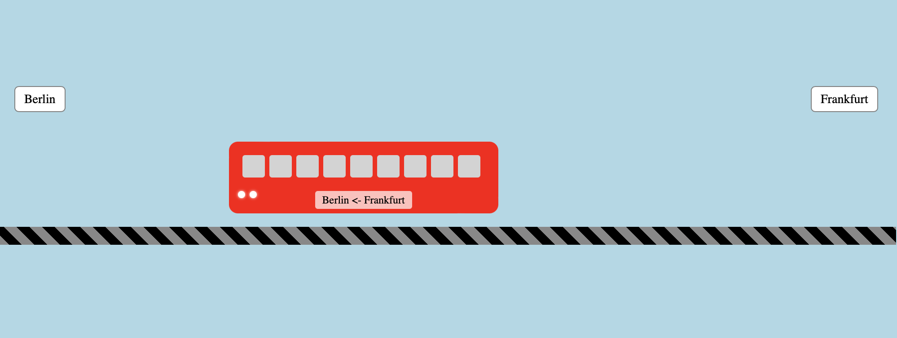

# DB_Train
DB Train with CSS, animated
# CSS Train Animation

This project demonstrates a moving train animation built entirely with HTML and CSS. The train moves continuously across the screen, passing between two city signs.

## Project Structure

The project consists of the following files:
- **index.html**: Contains the structure of the page including the train, its components (windows, lights, smoke), tracks, and city signs.
- **style.css**: Provides all styling and animations for the train, tracks, and signage.
- **README.md**: This file, which explains in detail how the project works.

## How It Works

1. **HTML Structure**:
   - The page is built around a `train-container` div that holds the entire animation.
   - Inside the container, the `train` div represents the moving train. It includes child elements such as `windows` for the train windows, `lights` for the headlights, and a `chimney` with its associated `smoke`.
   - Two `city-sign` elements display the names “Berlin” and “Frankfurt” at opposite sides of the container.

2. **CSS Styling and Animation**:
   - The **body** background is set to a light blue to resemble the sky.
   - The **train-container** holds the scene and sets its dimensions.
   - The **train** is styled with a red background (simulating a DB train) and rounded corners. It is animated using the `@keyframes trainMove`, which moves the train from right to left across the screen in an infinite loop.
   - **Windows** are displayed side-by-side using the Flexbox layout.
   - **Lights** (headlights) are small white circles with a glow effect.
   - The **tracks** are created with a repeating linear gradient, giving the effect of train rails.
   - **City signs** are positioned on the left and right to denote the origin and destination cities.

3. **Animation Details**:
   - The key animation `trainMove` shifts the train horizontally. When 0% of the animation starts, the train is off-screen to the right (starting position) and by 100% it has moved completely off the left side.
   - Although placeholders exist for additional animations like `puff` (for smoke), the current version focuses on the train movement and static elements.

## Visual Diagram

Below is a conceptual diagram showing the key components and their layout:

                 [City Sign: Berlin]                [City Sign: Frankfurt]
                            |                                   |
                            |                                   |
                ------------------- Train Container --------------------
                |                                              |
                |         [Tracks] --> (Bottom element)         |
                |                                              |
                |    [Train]                                   |
                |      |-- [Windows (left to right)]           |
                |      |-- [Lights (headlights)]               |
                |      |-- [Chimney + Smoke Placeholder]       |
                |                                              |
                ------------------------------------------------

## Screenshot

Below is a mockup of what the animation looks like. (Replace the link below with an actual screenshot image if available.)

## How to Run

1. Clone or download the repository to your computer.
2. Open the **index.html** file in your favorite web browser.
3. Watch the train move continuously across the screen!
4. Use python3 -m http.server 8000 to run it on a local server.

## Customizations

- Adjust the animation duration in the CSS `@keyframes trainMove` if you want the train to move faster or slower.
- Enhance the smoke or add more detailed animations using additional keyframes.
- Modify the city signs or background to fit your preferred design.

Enjoy experimenting with the CSS Train Animation!
